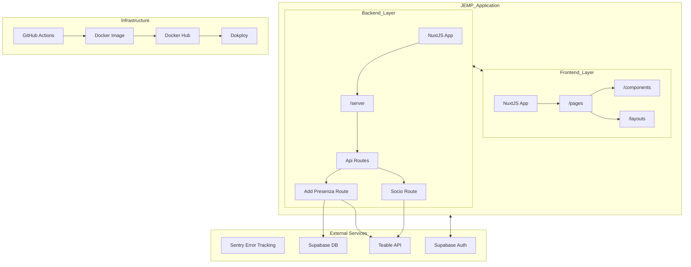

# Overview

## Purpose and Scope

This document provides a comprehensive overview of the JEMP application, a web-based system designed for event codes management, attendance tracking, and business card management. It covers the high-level architecture, core features, integration points, and technical stack. For detailed information about specific components, please refer to their respective documentation files: [Application Architecture](docs/architecture.md), [Core Features](docs/features.md), and [Configuration System](docs/configuration.md).

## System Overview

The JEMP application is built on Nuxt.js, providing a full-stack solution that encompasses both frontend and backend capabilities. The system integrates with Supabase for database and authentication services, Teable API for event data management, and Sentry for error tracking.



## Technical Stack

The JEMP application is built with the following technologies:

| **Layer**   | **Technologies**                   |
| ----------- | ---------------------------------- |
| Frontend    | Nuxt.js (Vue), Nuxt UI, TailwindCSS |
| Backend     | Nuxt.js API routes, Supabase       |
| Database    | Supabase                         |
| External APIs | Teable API                       |
| Monitoring  | Sentry                           |
| Deployment  | Docker, GitHub Actions             |

The application is configured primarily through `nuxt.config.ts`, which defines both public-facing settings (accessible to the client) and private configuration used by server-side components. Refer to the [Configuration System](docs/configuration.md) documentation for a complete breakdown of configuration options.

## Core Feature Architecture

The JEMP application revolves around 3 primary feature sets: attendance registration, events code management and business card management. These features interact with both Supabase and Kuntur API for data storage and retrieval. For a deeper dive into these features, consult the [Core Features](docs/features.md) documentation.

## Configuration System

The application's configuration is centralized in `nuxt.config.ts`, which provides both public (client-accessible) and private (server-only) configuration parameters.

| **Configuration Section** | **Purpose**                                      | **Example Settings**           |
| ------------------------- | ------------------------------------------------ | ------------------------------ |
| Public Configuration      | Client-accessible settings                         | Base URL, application version  |
| Kuntur Configuration      | Integration with Teable API                      | API token, domain, table names |
| Supabase Configuration    | Database and authentication settings               | Redirect options, cookie settings |
| Sentry Configuration      | Error tracking                                   | Source map upload settings     |

For a detailed explanation of each configuration option and how to set them, please see the [Configuration System](docs/configuration.md) documentation.

## Development and Deployment

The JEMP application follows a continuous integration and deployment approach using GitHub Actions. When commits with a specific format are pushed to the main branch, a new Docker image is built and published to Docker Hub, and a GitHub release is created.

The application is containerized using Docker, making it easy to deploy in various environments while ensuring consistency.

## Error Monitoring

Error monitoring is implemented using Sentry, which provides real-time error tracking and monitoring. The application is configured to upload source maps to Sentry for better error debugging in production.

## Local Development Setup

There are two recommended methods for setting up your local development environment for the JEMP application: using GitHub Codespaces or setting up your own local environment.

### Option 1: Using GitHub Codespaces

GitHub Codespaces provides a cloud-based development environment that is pre-configured with all the necessary tools and dependencies. This is often the easiest way to get started.

**Steps to develop using GitHub Codespaces:**

1.  **Navigate to the repository:** Go to the JEMP application's GitHub repository page.
2.  **Click the Code button:** Located near the top right of the repository page.
3.  **Select the "Codespaces" tab.**
4.  **Create a new Codespace:** Click the "Create codespace on main" button. GitHub will then provision a new Codespace based on the `.devcontainer` file present in the repository.
5.  **Wait for the Codespace to build:** This may take a few minutes as the environment is being set up.
6.  **Access the development environment:** Once the Codespace is ready, you will be presented with a VS Code editor running within your browser.
7.  **Open a terminal:** In the VS Code interface within Codespaces, open a new terminal (Terminal > New Terminal).
8.  **Install dependencies:** The `.devcontainer` should automatically install `bun`. To confirm or reinstall, run:
    ```bash
    bun install
    ```
9.  **Configure environment variables:** The devcontainer does not automatically set environment variables. You will need to create a `.env` file in the root of your project directory to provide configuration for external services like Supabase and Teable. A `.env.example` file is provided in the repository's root directory, illustrating the structure of the required variables. **It is crucial to fill this file with your actual credentials.** You can find example values or production credentials by viewing the environment variables used in your Dokploy deployment. Refer to the [Configuration System](docs/configuration.md) documentation for a comprehensive list of required variables and their descriptions.
10. **Run the development server:** Once dependencies are installed and environment variables are set, start the development server:
    ```bash
    bun run dev
    ```
11. **Access the application:** Codespaces will typically forward the development server port, allowing you to access the application in your browser. You should see a notification or link to open the application.

The `.devcontainer` file is crucial here. It defines the container environment used by Codespaces (and other development container tools), ensuring that essential tools like `bun` are installed and suggesting relevant VS Code extensions such as `tailwindcss`, `prettier`, `eslint`, `vue volar`, and `gitlens`. These extensions are highly recommended for a smooth development workflow, providing features like code formatting, linting, syntax highlighting, and Git integration.

### Option 2: Setting Up Your Own Local Environment

If you prefer to work in your own terminal and editor, you can set up the development environment directly on your machine.

**Steps to develop using your own environment:**

1.  **Clone the repository:** Open your terminal and clone the JEMP application repository:
    ```bash
    git clone [repository URL]
    cd [repository directory]
    ```
2.  **Install Node.js and Bun:** JEMP uses Nuxt.js, which requires Node.js. It also utilizes Bun as the package manager. If you don't have them installed, follow the official installation guides for your operating system.
    *   [Node.js Installation](https://nodejs.org/en/download/)
    *   [Bun Installation](https://bun.sh/docs/installation)
3.  **Install project dependencies:** Once Node.js and Bun are installed, navigate to the project directory in your terminal and install the project dependencies using Bun:
    ```bash
    bun install
    ```
4.  **Install Recommended VS Code Extensions (Optional but Recommended):** While not strictly necessary, installing the suggested VS Code extensions will greatly enhance your development experience. These are typically listed in the `.vscode/extensions.json` file (referenced by the `.devcontainer`). Open VS Code, go to the Extensions view (`Ctrl+Shift+X` or `Cmd+Shift+X`), and search for and install:
    *   Tailwind CSS IntelliSense (`bradlc.vscode-tailwindcss`)
    *   Prettier - Code formatter (`esbenp.prettier-vscode`)
    *   ESLint (`dbaeumer.vscode-eslint`)
    *   Vue Language Features (Volar) (`Vue.volar`)
    *   GitLens — Git supercharged (`eamodio.gitlens`)
5.  **Configure environment variables:** You will need to create a `.env` file in the root of your project directory to provide configuration for external services like Supabase and Teable. A `.env.example` file is provided in the repository's root directory, illustrating the structure of the required variables. **It is crucial to fill this file with your actual credentials.** You can find example values or production credentials by viewing the environment variables used in your Dokploy deployment. Refer to the [Configuration System](docs/configuration.md) documentation for a comprehensive list of required variables and their descriptions.
6.  **Run the development server:** Start the Nuxt development server using Bun:
    ```bash
    bun run dev
    ```
7.  **Access the application:** Open your web browser and navigate to the address provided by the development server, typically `http://localhost:3000`.

By following these steps, you will have a fully functional development environment for the JEMP application, allowing you to modify the code, test changes, and contribute to the project. Remember to consult the linked documentation files for more in-depth information on specific aspects of the application.