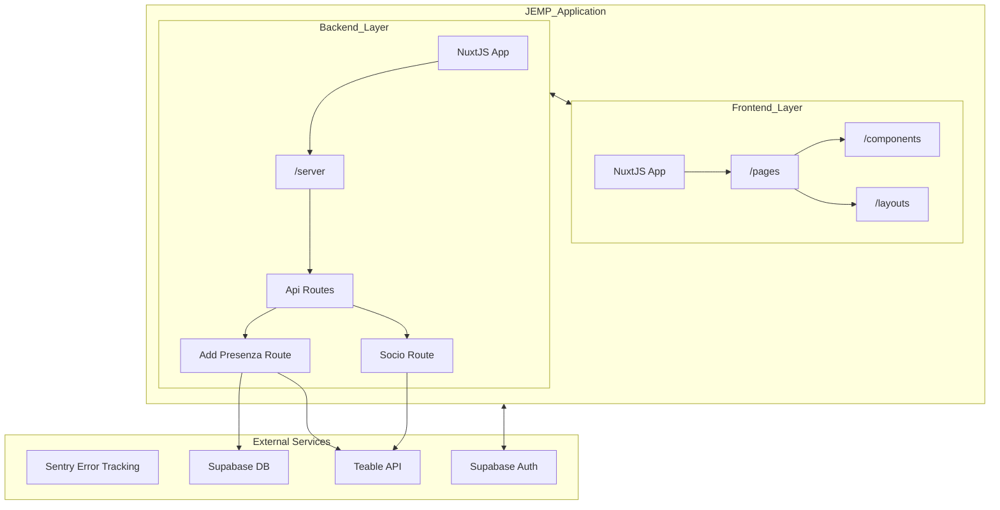

# Application Architecture

This document provides a comprehensive overview of the JEMP application's system architecture, including the frontend framework, backend services, external integrations, and communication patterns. It serves as a technical reference for understanding how the different components of the system interact.

## High-Level Architecture Overview

### System Architecture Diagram



The JEMP application is built on a modern web architecture with three main layers:

- Frontend Layer: Built with Nuxt.js and Vue components for handling user interface and client-side logic
- Backend Layer: Implemented using Nuxt server API endpoints for data processing and external service communication
- External Services: Third-party integrations with Supabase for database operations and authentication, Kuntur API for event and attendance data, and Sentry for error tracking

## Core Technologies

JEMP is built using the following core technologies:

| **Technology** | **Description** |
| --- | --- |
| Nuxt.js | Full-stack framework based on Vue.js |
| Supabase | Database and authentication provider |
| Teable API | External API for adding data to Kuntur DB |
| Sentry | Error tracking and monitoring |
| Docker | Containerization platform |

The application uses Nuxt.js version 3, as evidenced by the module imports and configuration structure. It leverages several Nuxt modules to extend functionality:

```javascript
modules: [
  "@nuxt/eslint",
  "@nuxtjs/supabase",
  "@nuxt/ui",
  "@nuxt/image",
  "@sentry/nuxt/module",
]
```

## Frontend Architecture

### Frontend Component Structure

The frontend architecture leverages Nuxt.js features:

- UI Framework: The application extends @nuxt/ui-pro and uses @nuxt/ui for consistent styling
- Component Structure: Organized into reusable feature components and page components
- Image Handling: Uses @nuxt/image for optimized image processing
- Authentication Flow: Managed through Supabase with login and callback redirects configured

The application includes specialized pages that are exempted from authentication requirements, such as the business card view page: /bcard/view/*

## Backend Services

### Backend Service Architecture

The backend layer consists of:

- Nitro Server: Configured to use Bun as the runtime preset
- API Endpoints: Server-side API routes that process data and communicate with external services
- Runtime Configuration: Split into public (client-accessible) and private (server-only) configuration
    - Public configuration includes baseUrl, appVersion, and KPI settings
    - Private configuration includes Kuntur API credentials and table mappings

The server API endpoints interact with both Supabase for database operations and the Kuntur API for event-related data.

## External Integrations

### External Service Integration Diagram

The application integrates with three primary external services:

- Supabase Integration
  - Configured in nuxt.config.ts under the supabase section
  - Provides authentication with redirect options for login and callback pages
  - Excludes specific routes like /bcard/view/* from authentication requirements
  - TypeScript types are generated in ./interfaces/supabase.ts
- Kuntur API Integration
  - Configured in the runtimeConfig.kuntur section
  - Contains token, domain, and table mappings
  - Used for event data and attendance tracking
  - Tables referenced include eventiTable, rgTable, and sociTable
- Sentry Error Tracking
  - Configured via the sentry module and dedicated configuration files
  - Used for error monitoring and reporting in both client and server contexts
  - Includes source map upload configuration for better error reporting
  - Project is identified as "javascript-nuxt" under the "jemp" organization

## Configuration System

### Configuration System Structure

The configuration system is centralized in nuxt.config.ts and structured as follows:

- Runtime Configuration: Split into:
  - Public configuration: Client-accessible values including baseUrl, appVersion, and KPI settings
  - Private configuration: Server-only values including Kuntur API credentials and table mappings
- Module Configuration: Settings for Nuxt modules:
  - Supabase configuration for authentication and database access
  - Sentry configuration for error tracking
  - UI and image processing modules
- Environment-Specific Settings:
  - Cookie security based on environment (process.env.NODE_ENV === "production")
  - Sourcemap configuration for production environments

## Data Flow

### Core Features Data Flow

The data flow processes follow these patterns:

- Attendance Registration:
  - User interacts with the RegistraPresenza component
  - Component retrieves event data from Supabase's eventi table
  - Component communicates with /api/socio and /api/add_presenza.post.ts endpoints
  - Attendance data is stored in Kuntur tables
- Business Card Management:
  - Business card components interact directly with Supabase's business_card table
  - Public business card viewing is available without authentication
- Event Management:
  - Event management components interact with Supabase's eventi and codici_evento tables

## Summary

The JEMP application architecture employs a modern full-stack approach using Nuxt.js as its foundation. The key architectural characteristics include:

- Frontend + Backend in One Framework: Nuxt.js provides both client-side rendering and server-side API endpoints
- External Service Integration: Seamless integration with Supabase for database/authentication, Kuntur for event data, and Sentry for monitoring
- Centralized Configuration: All configuration is managed through nuxt.config.ts
- Feature Isolation: Clear separation of concerns between attendance registration, business card management, and event tracking features