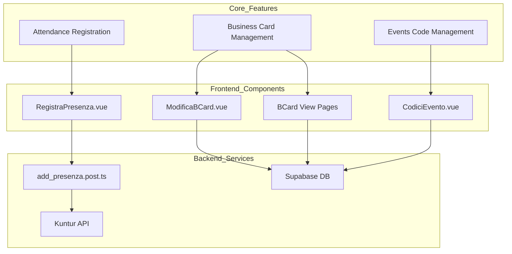
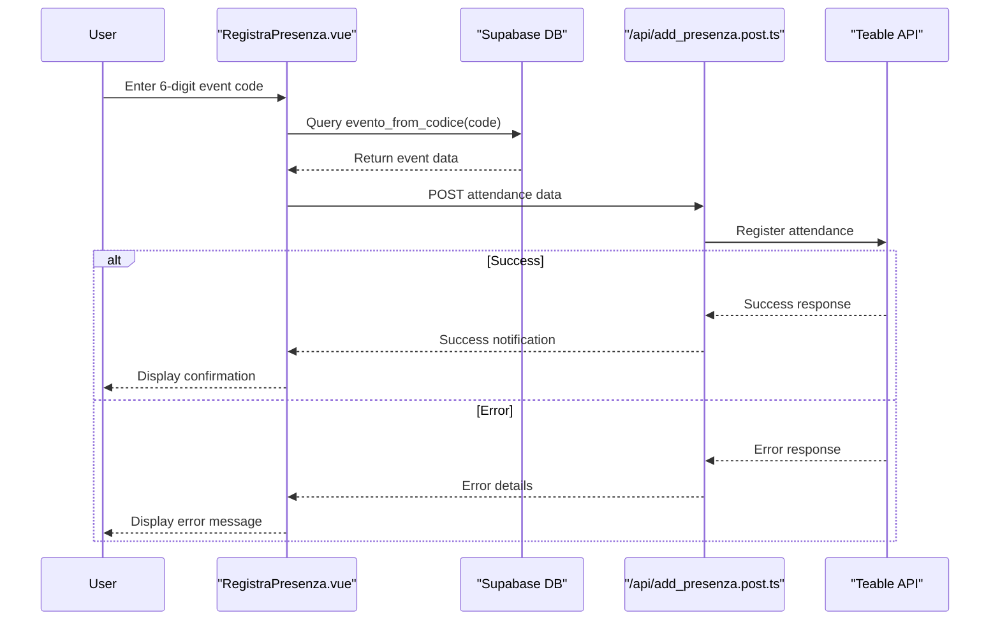

# Core Features

This document provides an overview of the primary functionality in the JEMP application. It details the 3 core features: Attendance Registration and Business Card Management, and Events Code Management.

## Feature Overview

The JEMP application provides three key features that form the backbone of its functionality:

### 1. Attendance Registration System

The Attendance Registration System allows users to register their presence at JEMP events by entering a 6-digit code. This feature connects the Supabase and Kuntur systems to track event participation.

#### Technical Flow

#### Implementation Details
The Attendance Registration process consists of two main components:

- Frontend Component (RegistraPresenza.vue)
    - Accepts a 6-digit code input from the user
    - Validates the code format using Yup schema
    - Retrieves event information using Supabase RPC
    - Fetches user data from the server
    - Submits attendance data to the backend
    - Displays success/error messages to the user
- Backend API (add_presenza.post.ts)
    - Verifies user authentication
    - Accepts id_socio, id_evento, and tipologia parameters
    - Determines the appropriate Kuntur table based on event type:
        - Riunione Generale type → RG Table
        - Evento type → Eventi Table
    - Implements retry logic (up to 3 attempts) for reliability
    - Integrates with Sentry for error tracking

### 2. Business Card Management

The Business Card Management system enables users to create, edit, view, and share digital business cards that contain their professional information.

#### Data Model
The Business Card system stores the following information:

| **Field** | **Description** |
| --- | --- |
| **`nome`** | User's first name |
| **`cognome`** | User's last name |
| **`ruolo`** | User's professional role |
| **`email_jemp`** | User's JEMP email |
| **`numero_cellulare`** | User's phone number |
| **`url_linkedin`** | LinkedIn profile URL |
| **`avatar_url`** | User's profile picture |

#### Functionality
The Business Card system provides:

- Card Creation and Editing (ModificaBCard.vue)
    - Form validation using Yup schema
    - Real-time data updates to Supabase
    - Profile picture management (synchronized with Google account)
- Card Viewing (pages/bcard/view/[id].vue)
    - Public viewing by ID
    - Responsive layout for various devices
    - Contact options (email, phone, LinkedIn)
- Card Sharing
    - QR code generation
    - vCard export for contact import

### 3. Event Management

The Events Code Management system provides a way to view events and their associated 6-digit codes for attendance tracking.

#### Data Structure

#### Implementation
The CodiciEvento.vue component:

- Retrieves events and their associated codes from Supabase
- Formats dates using the localeDate utility
- Displays the information in a tabular format
- Handles error cases with toast notifications
    
The event management system stores:

- Event names
- Event dates
- Associated 6-digit codes
- Event types (Riunione Generale or Evento)

These codes are used by the Attendance Registration system to link user attendance to specific events.
