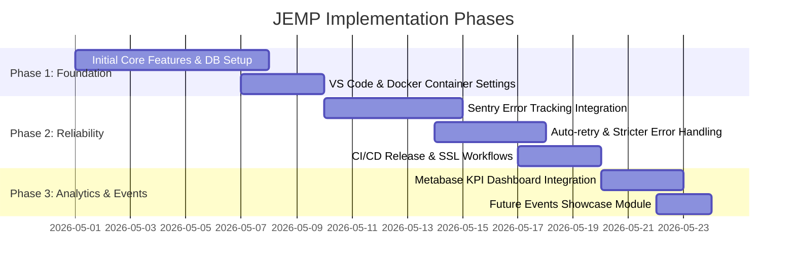
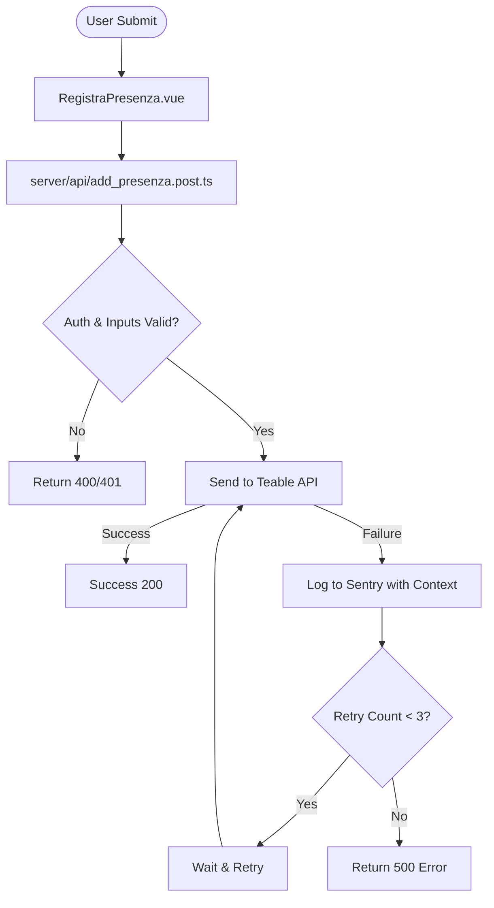
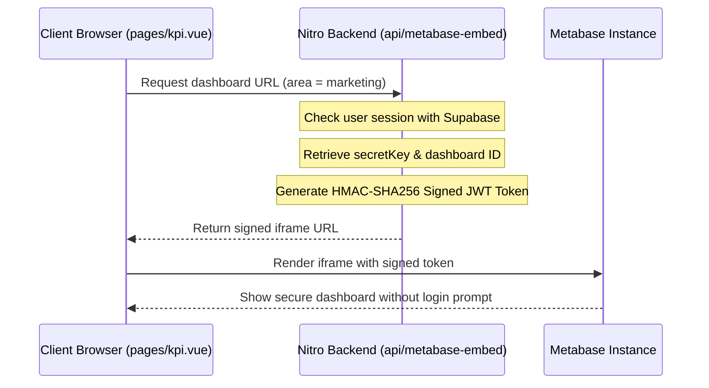

# JEMP Application - Technical Implementations Report

This document provides a comprehensive technical overview of all implementations, enhancements, and features introduced in the JEMP application. It details the development timeline, from the initial core system setup to the latest KPI dashboard and events module.

---

## High-Level Implementation Timeline

The development of the JEMP application was executed in distinct phases, focusing on stabilizing the core functionality, enhancing reliability and error tracking, and finally adding business intelligence and event discovery capabilities.

---

## 1. Phase 1: Core System & Infrastructure

### 1.1 Core Business Features
- **Attendance Registration System**: Built a 6-digit verification system to register members' presence at association events. Integrated frontend validations (using Yup) with backend triggers interfacing with Kuntur (Teable).
- **Digital Business Card Management**: Implemented public-facing digital business cards (/bcard/view/[id]) with contact information (email, phone, LinkedIn, avatar) and local vCard export capabilities, backed by Supabase DB.
- **Event Code Management**: Created an administration panel enabling authorized officers to view and generate 6-digit access codes for upcoming events.

### 1.2 Development Environment Containerization
- **Dockerization**: Defined `Dockerfile` and `.dockerignore` for compiling the Nuxt 3 project using a Node/Bun-based runtime, ensuring environment consistency across developer machines.
- **VS Code Workspaces**: Configured `.vscode/settings.json` and dev container tools to standardize code formatting (Prettier, ESLint) and debugging.

---

## 2. Phase 2: Reliability & Observability Engineering

To ensure the high-frequency attendance registration API does not drop requests under heavy load, several reliability patterns were implemented.

### 2.1 Full-Stack Sentry Telemetry
- **Sentry Integration**: Added `@sentry/nuxt/module` to `nuxt.config.ts`, creating client (`sentry.client.config.ts`) and server (`sentry.server.config.ts`) reporting files.
- **Context Enrichment**: Enriched error payloads sent to Sentry with details such as current user ID, event code entered, target table, and HTTP response statuses to dramatically reduce debugging times.

### 2.2 Auto-Retry & Backoff Mechanics
- **Resilience**: Implemented auto-retry with exponential backoff on the server-side presence registration route. In case of network congestion, rate limits, or transient Teable outages, the server transparently retries the request up to 3 times before returning an error page to the user.

### 2.3 Automating Source Map Uploads
- **Release Workflows**: Configured GitHub actions release flows to package application source maps for Sentry. Added custom SSL/CA certificate trust steps to allow secure connections during command-line releases.

---

## 3. Phase 3: Metabase KPI Dashboard Integration (Staged)

To provide the board and departments with business intelligence, we designed a dashboard system embedding Metabase reports securely.

### 3.1 Secure JWT Token Generation
- **HMAC-SHA256 Signing**: Configured a server-side endpoint (`server/api/metabase-embed.get.ts`) that signs access tokens using `node:crypto`. This prevents exposing the Metabase secret key to the client side.
- **Dynamic Area Routing**: Supports four distinct organizational areas:
  - **Audit & IT** (Dashboard ID configured via env)
  - **HR** (Dashboard ID configured via env)
  - **Marketing** (Dashboard ID configured via env)
  - **Commerciale** (Dashboard ID configured via env)

### 3.2 Responsive Dashboard UI
- **Reusable Component**: Built `KpiDashboardPanel.vue` to manage iframe styling, full-screen options, and clean loading/error recovery states.
- **Tabs Layout**: Implemented `pages/kpi.vue` utilizing `@nuxt/ui` tabs to allow seamless navigation between departments.

---

## 4. Phase 4: Future Events Showcase Module (Staged)

To increase event visibility, we created a public listing of all future events.

### 4.1 Server-Side Event Aggregation
- **API Endpoint**: Created `server/api/eventi-futuri.get.ts` to query Teable records.
- **Timezone Filters**: Configured query parameters to filter events where date is after `yesterday` relative to Rome timezone (`Europe/Rome`), ordering the results so the closest event appears first.

### 4.2 Interactive Listing Page
- **Client Filters**: Built a dynamic UI (`pages/eventi.vue`) allowing users to filter by Event Type (*Formazione, Workshop, Assemblea, etc.*) and Target Group (*Alumni, Board, IT, etc.*) alongside a real-time text search.
- **Visual Design**: Designed badges utilizing custom Tailwind colors for each target/type, including display of duration, costs (with a green "Gratuito" tag), and registered count.

---

## Technical File Mapping

Below is a breakdown of the key files modified or added during these implementations:

| File Path | Status | Purpose |
| :--- | :--- | :--- |
| [`nuxt.config.ts`](file:///Users/andreabrugnera/Personal_projects/jemp_app/nuxt.config.ts) | Modified | Added Sentry, Metabase configuration parameters, and runtime modules |
| [`.env.example`](file:///Users/andreabrugnera/Personal_projects/jemp_app/.env.example) | Modified | Outlined environments variable definitions for Metabase dashboard IDs |
| [`pages/kpi.vue`](file:///Users/andreabrugnera/Personal_projects/jemp_app/pages/kpi.vue) | New (Staged) | Interface for dashboard tabs (Audit & IT, HR, Marketing, Commerciale) |
| [`components/KpiDashboardPanel.vue`](file:///Users/andreabrugnera/Personal_projects/jemp_app/components/KpiDashboardPanel.vue) | New (Staged) | Reusable panel handling iframe embeds, loaders, and error states |
| [`server/api/metabase-embed.get.ts`](file:///Users/andreabrugnera/Personal_projects/jemp_app/server/api/metabase-embed.get.ts) | New (Staged) | Endpoint to securely sign and issue JWT tokens for Metabase |
| [`pages/eventi.vue`](file:///Users/andreabrugnera/Personal_projects/jemp_app/pages/eventi.vue) | New (Staged) | Interactive frontend events listing, sorting, and search UI |
| [`server/api/eventi-futuri.get.ts`](file:///Users/andreabrugnera/Personal_projects/jemp_app/server/api/eventi-futuri.get.ts) | New (Staged) | Endpoint to query future events from Teable database with timezone-aware filters |
| [`layouts/default.vue`](file:///Users/andreabrugnera/Personal_projects/jemp_app/layouts/default.vue) | Modified | Updated navigation to include links to KPI dashboards and future events |
| [`pages/index.vue`](file:///Users/andreabrugnera/Personal_projects/jemp_app/pages/index.vue) | Modified | Added homepage call-to-action cards for the new sections |
